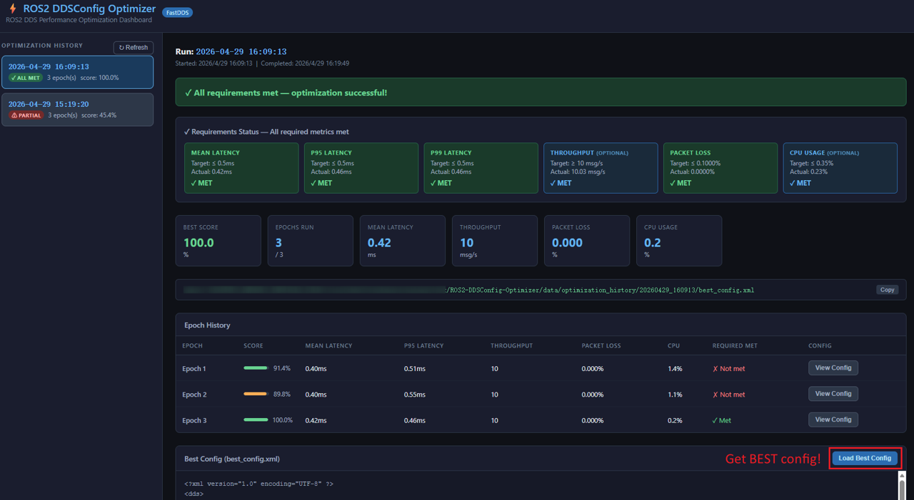

<div align="center">

# ROS2 DDSConfig Optimizer

[](https://www.ros.org/)
[](https://fast-dds.docs.eprosima.com/)
[](#license)

<p>
  <strong>An AI-driven tool that automatically tunes DDS configuration for ROS2 applications.</strong>
</p>

<p>
  
</p>

<p>
  <a href="#overview">Overview</a> •
  <a href="#requirements">Requirements</a> •
  <a href="#usage">Usage</a> •
  <a href="#contributing">Contributing</a> •
  <a href="#license">License</a>
</p>

</div>

---

## Overview

**😡Are you still struggling to tune hundreds of DDS parameters?**

ROS2 DDSConfig Optimizer is here to help! It uses LLMs to automatically tune DDS configuration for ROS 2 applications.

🫵You only need to provide:

1. **Performance targets** such as latency, throughput, reliability, CPU usage, and memory usage in a simple XML file
2. **An initial DDS configuration** as the baseline

🏃‍♀️‍➡️ROS2 DDSConfig Optimizer will then automatically:

1. Run your ROS 2 application
2. Benchmark your ROS 2 application
3. Tune DDS parameters iteratively

😆Finially, you will get an optimized DDS configuration tailored to your ROS 2 application.

---

## Requirements

| Item | Requirement |
|---|---|
| **OS** | Ubuntu |
| **ROS 2** | Humble, Jazzy |
| **Package manager** | [uv](https://docs.astral.sh/uv/) ≥ 0.7.8 |

---

## Usage

See **[`example/README.md`](example/README.md)** for a complete, copy-paste-ready walkthrough.

### Step 1: Setup

```bash README.md
cd ROS2-DDSConfig-Optimizer
uv sync
```

### Step 2: Provide Performance Targets and Initial DDS Configuration

See:

- [`user_requirements_template.xml`](data/templates/user_requirements_template.xml)
- [`fastdds_config_template.xml`](data/templates/fastdds_config_template.xml)

CycloneDDS is now supported alongside FastDDS. To optimize a CycloneDDS deployment, set `<dds_implementation>cyclonedds</dds_implementation>` in your `user_requirements.xml` (the default is `fastdds`).

### Step 3: Choose a Benchmark Tool and Provide Benchmark Scripts

Currently, only [`ros2_benchmark`](https://github.com/qualcomm-qrb-ros/ros2_benchmark) is supported.

### Step 4: Run the Optimizer

```bash README.md
uv run dds-optimizer run \
    --requirements /path/to/user_requirements.xml \
    --initial-config /path/to/initial_DDS_config.xml
```

### Step 5: View Optimization History and Get BEST config

> the best config will be placed in data/optimization_history

```bash README.md
uv run dds-optimizer dashboard --port 5000
```

Open `http://localhost:5000/` in your browser:

<p align="center">
  
</p>

---

## Contributing

We welcome community contributions.

To get started, please read [CONTRIBUTING.md](CONTRIBUTING.md).
Feel free to open an issue for bug reports, feature requests, or general discussion.

---

## License

This project is licensed under the [BSD-3-Clause](https://spdx.org/licenses/BSD-3-Clause.html) License. See [LICENSE](./LICENSE) for the full license text.
